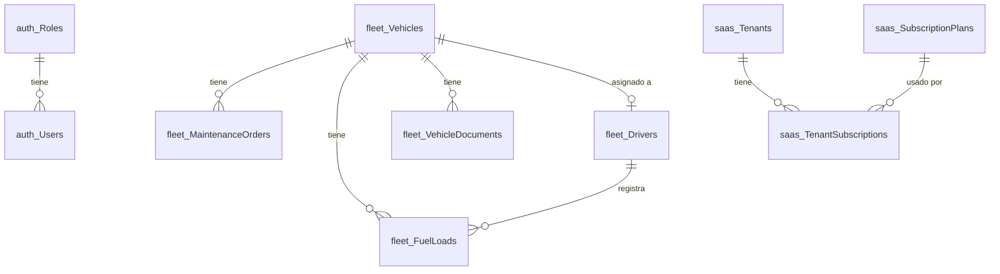

# 🚛 TrackWay - Sistema de Gestión de Flotas

<div align="center">


**Sistema empresarial completo para la gestión de flotas vehiculares, conductores y mantenimiento**

[Características](#-características) • [Instalación](#-instalación) • [Base de Datos](#-base-de-datos) • [API](#-api) • [Frontend](#-frontend)

</div>

---

## 📋 Descripción

TrackWay es una plataforma SaaS multi-tenant para la gestión integral de flotas vehiculares. Permite administrar vehículos, conductores, mantenimientos, documentos y combustible con un dashboard en tiempo real.

## ✨ Características

### 🚗 Gestión de Vehículos
- Registro completo de flota vehicular
- Seguimiento de kilometraje
- Estados operativos (Activo, En Mantenimiento, En Ruta, Fuera de Servicio)
- Control de documentos (SOAT, Revisión Técnica, Permisos)

### 👨‍✈️ Gestión de Conductores
- Perfiles completos de conductores
- Control de licencias y vencimientos
- Sistema de scoring de seguridad
- Asignación de vehículos

### 🔧 Mantenimiento
- Órdenes de mantenimiento preventivo y correctivo
- Tracking de costos estimados vs reales
- Alertas de mantenimientos pendientes
- Historial completo por vehículo

### ⛽ Control de Combustible
- Registro de cargas de combustible
- Cálculo de rendimiento (km/galón)
- Reportes de consumo

### 🏢 Multi-Tenancy (SaaS)
- Gestión de múltiples empresas/clientes
- Planes de suscripción (Free, Pro, Enterprise)
- Panel de SuperAdmin

---

## 🛠️ Tecnologías

### Backend
- **.NET 10** - Framework principal
- **Entity Framework Core 10** - ORM
- **MediatR** - Patrón CQRS
- **FluentValidation** - Validaciones
- **JWT** - Autenticación
- **SQL Server** - Base de datos

### Frontend
- **React 18** con TypeScript
- **Vite** - Build tool
- **Material UI (MUI)** - Componentes UI
- **React Query** - Estado del servidor
- **React Router** - Enrutamiento
- **i18next** - Internacionalización

---

## 🚀 Instalación

### Prerrequisitos
- [.NET 10 SDK](https://dotnet.microsoft.com/download)
- [Node.js 20+](https://nodejs.org/)
- [SQL Server 2019+](https://www.microsoft.com/sql-server) o SQL Server Express
- [Git](https://git-scm.com/)

### 1. Clonar el repositorio
```bash
git clone https://github.com/tu-usuario/SistemadeFlota.git
cd SistemadeFlota
```

### 2. Configurar la Base de Datos

Asegúrate de tener SQL Server corriendo y actualiza la cadena de conexión en `TrackWay.API/appsettings.json`:

```json
{
  "ConnectionStrings": {
    "DefaultConnection": "Server=localhost;Database=TrackWayDb;Trusted_Connection=True;MultipleActiveResultSets=true;TrustServerCertificate=True"
  }
}
```

### 3. Aplicar Migraciones
```bash
cd TrackWay.API
dotnet ef database update
```

### 4. Ejecutar el Backend
```bash
cd TrackWay.API
dotnet run
```
El API estará disponible en: `http://localhost:5112`

### 5. Instalar dependencias del Frontend
```bash
cd TrackWay.Frontend
npm install
```

### 6. Ejecutar el Frontend
```bash
npm run dev
```
La aplicación estará disponible en: `http://localhost:3000`

---

## 💾 Base de Datos

### Cadena de Conexión

```
Server=localhost;Database=TrackWayDb;Trusted_Connection=True;MultipleActiveResultSets=true;TrustServerCertificate=True
```

#### Variantes de conexión:

**SQL Server con Windows Authentication:**
```
Server=localhost;Database=TrackWayDb;Trusted_Connection=True;MultipleActiveResultSets=true;TrustServerCertificate=True
```

**SQL Server con SQL Authentication:**
```
Server=localhost;Database=TrackWayDb;User Id=sa;Password=TuPassword123;MultipleActiveResultSets=true;TrustServerCertificate=True
```

**SQL Server Express LocalDB:**
```
Server=(localdb)\\mssqllocaldb;Database=TrackWayDb;Trusted_Connection=True;MultipleActiveResultSets=true
```

**SQL Server en contenedor Docker:**
```
Server=localhost,1433;Database=TrackWayDb;User Id=sa;Password=YourStrong!Passw0rd;TrustServerCertificate=True
```

---

### 📊 Esquema de Base de Datos

La base de datos está organizada en **4 esquemas**:

```
TrackWayDb
├── 🔐 auth          (Autenticación y usuarios)
├── 🚛 fleet         (Gestión de flota)
├── 🍽️ restaurante   (Módulo restaurante)
└── 🏢 saas          (Multi-tenancy)
```

---

### 🔐 Esquema `auth` - Autenticación

#### Tabla: `auth.Roles`
| Columna | Tipo | Restricciones | Descripción |
|---------|------|---------------|-------------|
| `Id` | int | PK, Identity | Identificador único |
| `Nombre` | nvarchar(50) | NOT NULL, UNIQUE | Nombre del rol |
| `Descripcion` | nvarchar(200) | NULL | Descripción |
| `Permisos` | nvarchar(2000) | NULL | JSON con permisos |

#### Tabla: `auth.Users`
| Columna | Tipo | Restricciones | Descripción |
|---------|------|---------------|-------------|
| `Id` | int | PK, Identity | Identificador único |
| `Email` | nvarchar(256) | NOT NULL, UNIQUE | Email del usuario |
| `NombreCompleto` | nvarchar(200) | NOT NULL | Nombre completo |
| `PasswordHash` | nvarchar(500) | NOT NULL | Hash de contraseña |
| `RefreshToken` | nvarchar(500) | NULL | Token de refresco |
| `RefreshTokenExpiry` | datetime2 | NULL | Expiración del token |
| `Activo` | bit | NOT NULL | Estado activo |
| `RoleId` | int | FK → auth.Roles | Rol asignado |
| `UltimoAcceso` | datetime2 | NULL | Último login |
| `IntentosFallidos` | int | NOT NULL | Intentos de login fallidos |
| `BloqueoHasta` | datetime2 | NULL | Bloqueo temporal |

---

### 🚛 Esquema `fleet` - Gestión de Flota

#### Tabla: `fleet.Vehicles`
| Columna | Tipo | Restricciones | Descripción |
|---------|------|---------------|-------------|
| `Id` | int | PK, Identity | Identificador único |
| `Placa` | nvarchar(20) | NOT NULL, UNIQUE | Placa del vehículo |
| `VIN` | nvarchar(50) | UNIQUE | Número de chasis |
| `Marca` | nvarchar(50) | NOT NULL | Marca |
| `Modelo` | nvarchar(50) | NOT NULL | Modelo |
| `AnoFabricacion` | int | NOT NULL | Año de fabricación |
| `Color` | nvarchar(30) | NULL | Color |
| `Combustible` | nvarchar(20) | NOT NULL | Tipo (Gasolina, Diesel, GLP, etc.) |
| `Estado` | nvarchar(30) | NOT NULL | Estado operativo |
| `KmActual` | decimal(12,2) | NOT NULL | Kilometraje actual |
| `CapacidadTanque` | decimal(8,2) | NULL | Capacidad en galones |
| `ConductorAsignadoId` | int | FK → fleet.Drivers | Conductor asignado |
| `FechaRegistro` | datetime2 | NOT NULL | Fecha de registro |
| `FechaUltimoMantenimiento` | datetime2 | NULL | Último mantenimiento |

#### Tabla: `fleet.Drivers`
| Columna | Tipo | Restricciones | Descripción |
|---------|------|---------------|-------------|
| `Id` | int | PK, Identity | Identificador único |
| `Nombre` | nvarchar(100) | NOT NULL | Nombres |
| `Apellidos` | nvarchar(100) | NOT NULL | Apellidos |
| `Documento` | nvarchar(20) | NOT NULL, UNIQUE | DNI/CE |
| `Email` | nvarchar(100) | NULL | Correo electrónico |
| `Telefono` | nvarchar(20) | NULL | Teléfono |
| `FotoUrl` | nvarchar(500) | NULL | URL de foto |
| `LicenciaNum` | nvarchar(30) | NOT NULL, UNIQUE | Número de licencia |
| `CategoriaLicencia` | nvarchar(20) | NOT NULL | Categoría (AI, AIIa, AIIb, etc.) |
| `LicenciaVencimiento` | datetime2 | NOT NULL | Fecha de vencimiento |
| `ScoringSeguridad` | decimal(5,2) | NOT NULL | Score de seguridad (0-100) |
| `TotalViajes` | int | NOT NULL | Total de viajes realizados |
| `KmTotalesRecorridos` | decimal(12,2) | NOT NULL | Km totales |
| `Activo` | bit | NOT NULL | Estado activo |
| `FechaContratacion` | datetime2 | NOT NULL | Fecha de contratación |
| `FechaBaja` | datetime2 | NULL | Fecha de baja |
| `VehiculoAsignadoId` | int | FK → fleet.Vehicles | Vehículo asignado |

#### Tabla: `fleet.MaintenanceOrders`
| Columna | Tipo | Restricciones | Descripción |
|---------|------|---------------|-------------|
| `Id` | int | PK, Identity | Identificador único |
| `VehicleId` | int | FK → fleet.Vehicles | Vehículo |
| `Tipo` | nvarchar(30) | NOT NULL | Tipo (Preventivo, Correctivo, etc.) |
| `Estado` | nvarchar(30) | NOT NULL | Estado de la orden |
| `Descripcion` | nvarchar(500) | NULL | Descripción del trabajo |
| `Observaciones` | nvarchar(1000) | NULL | Observaciones |
| `Proveedor` | nvarchar(200) | NULL | Proveedor/Taller |
| `FechaProgramada` | datetime2 | NOT NULL | Fecha programada |
| `FechaInicio` | datetime2 | NULL | Fecha de inicio real |
| `FechaFinalizacion` | datetime2 | NULL | Fecha de finalización |
| `KmAlMomento` | decimal(12,2) | NOT NULL | Km al crear la orden |
| `KmProximoMantenimiento` | decimal(12,2) | NULL | Km para próximo mantenimiento |
| `CostoEstimado` | decimal(12,2) | NOT NULL | Costo estimado |
| `CostoReal` | decimal(12,2) | NULL | Costo real |

#### Tabla: `fleet.FuelLoads`
| Columna | Tipo | Restricciones | Descripción |
|---------|------|---------------|-------------|
| `Id` | int | PK, Identity | Identificador único |
| `VehicleId` | int | FK → fleet.Vehicles | Vehículo |
| `ConductorId` | int | FK → fleet.Drivers | Conductor |
| `Fecha` | datetime2 | NOT NULL | Fecha de carga |
| `Galones` | decimal(10,3) | NOT NULL | Cantidad en galones |
| `PrecioPorGalon` | decimal(10,4) | NOT NULL | Precio unitario |
| `KmOdometro` | decimal(12,2) | NOT NULL | Lectura del odómetro |
| `TanqueLleno` | bit | NOT NULL | ¿Tanque lleno? |
| `Estacion` | nvarchar(200) | NULL | Estación de servicio |
| `NumeroVoucher` | nvarchar(50) | NULL | Número de comprobante |

#### Tabla: `fleet.VehicleDocuments`
| Columna | Tipo | Restricciones | Descripción |
|---------|------|---------------|-------------|
| `Id` | int | PK, Identity | Identificador único |
| `VehicleId` | int | FK → fleet.Vehicles | Vehículo |
| `Tipo` | nvarchar(30) | NOT NULL | Tipo (SOAT, RevisionTecnica, etc.) |
| `NumeroDocumento` | nvarchar(50) | NOT NULL | Número del documento |
| `FechaEmision` | datetime2 | NOT NULL | Fecha de emisión |
| `FechaVencimiento` | datetime2 | NOT NULL | Fecha de vencimiento |
| `ArchivoUrl` | nvarchar(500) | NULL | URL del archivo |
| `Emisor` | nvarchar(200) | NULL | Entidad emisora |
| `Costo` | decimal(12,2) | NULL | Costo del documento |
| `Activo` | bit | NOT NULL | Estado activo |

---

### 🏢 Esquema `saas` - Multi-Tenancy

#### Tabla: `saas.SubscriptionPlans`
| Columna | Tipo | Restricciones | Descripción |
|---------|------|---------------|-------------|
| `Id` | int | PK, Identity | Identificador único |
| `Nombre` | nvarchar(50) | NOT NULL, UNIQUE | Nombre del plan |
| `Descripcion` | nvarchar(500) | NULL | Descripción |
| `PrecioMensual` | decimal(10,2) | NOT NULL | Precio mensual |
| `MaxUsuarios` | int | NOT NULL | Máximo de usuarios |
| `MaxVehiculos` | int | NOT NULL | Máximo de vehículos |
| `Tier` | nvarchar(20) | NOT NULL | Nivel (Free, Pro, Enterprise) |
| `Activo` | bit | NOT NULL | Estado activo |
| `ColorHex` | nvarchar(10) | NULL | Color del plan |

**Datos precargados:**
| Plan | Precio | Max Usuarios | Max Vehículos |
|------|--------|--------------|---------------|
| Free | $0 | 3 | 5 |
| Pro | $49 | 15 | 30 |
| Enterprise | $199 | 100 | 500 |

#### Tabla: `saas.Tenants`
| Columna | Tipo | Restricciones | Descripción |
|---------|------|---------------|-------------|
| `Id` | int | PK, Identity | Identificador único |
| `Nombre` | nvarchar(200) | NOT NULL | Nombre de la empresa |
| `RUC` | nvarchar(20) | NOT NULL, UNIQUE | RUC de la empresa |
| `EmailContacto` | nvarchar(256) | NOT NULL | Email de contacto |
| `Telefono` | nvarchar(20) | NULL | Teléfono |
| `Direccion` | nvarchar(500) | NULL | Dirección |
| `LogoUrl` | nvarchar(500) | NULL | URL del logo |
| `Activo` | bit | NOT NULL | Estado activo |
| `FechaCreacion` | datetime2 | NOT NULL | Fecha de registro |
| `FechaDesactivacion` | datetime2 | NULL | Fecha de baja |
| `TotalUsuarios` | int | NOT NULL | Usuarios actuales |
| `TotalVehiculos` | int | NOT NULL | Vehículos actuales |
| `TotalMantenimientos` | int | NOT NULL | Mantenimientos totales |

#### Tabla: `saas.TenantSubscriptions`
| Columna | Tipo | Restricciones | Descripción |
|---------|------|---------------|-------------|
| `Id` | int | PK, Identity | Identificador único |
| `TenantId` | int | FK → saas.Tenants | Empresa |
| `SubscriptionPlanId` | int | FK → saas.SubscriptionPlans | Plan |
| `FechaInicio` | datetime2 | NOT NULL | Inicio de suscripción |
| `FechaFin` | datetime2 | NULL | Fin de suscripción |

---

### 🍽️ Esquema `restaurante` - Módulo Restaurante

> Módulo adicional para gestión de restaurantes (opcional)

#### Tablas incluidas:
- `restaurante.Categorias` - Categorías de productos
- `restaurante.Productos` - Menú de productos
- `restaurante.Mesas` - Mesas del local
- `restaurante.Empleados` - Personal
- `restaurante.Ordenes` - Órdenes de servicio
- `restaurante.DetallesOrden` - Items de cada orden
- `restaurante.Reservaciones` - Reservas de mesas

---

### 📈 Diagrama ER (Entidad-Relación)



---

## 🔑 API Endpoints

### Autenticación
| Método | Endpoint | Descripción |
|--------|----------|-------------|
| POST | `/api/auth/login` | Iniciar sesión |
| POST | `/api/auth/refresh` | Renovar token |
| POST | `/api/auth/register` | Registrar usuario |

### Vehículos
| Método | Endpoint | Descripción |
|--------|----------|-------------|
| GET | `/api/vehicles` | Listar vehículos |
| GET | `/api/vehicles/{id}` | Obtener vehículo |
| POST | `/api/vehicles` | Crear vehículo |
| PATCH | `/api/vehicles/{id}/kilometraje` | Actualizar km |
| GET | `/api/vehicles/alertas` | Alertas de documentos |

### Conductores
| Método | Endpoint | Descripción |
|--------|----------|-------------|
| GET | `/api/drivers` | Listar conductores |
| GET | `/api/drivers/{id}` | Obtener conductor |
| POST | `/api/drivers` | Crear conductor |
| PATCH | `/api/drivers/{id}/scoring` | Actualizar scoring |
| PATCH | `/api/drivers/{id}/renovar-licencia` | Renovar licencia |
| GET | `/api/drivers/alertas/licencia` | Alertas de licencias |

### Mantenimiento
| Método | Endpoint | Descripción |
|--------|----------|-------------|
| GET | `/api/maintenance` | Listar órdenes |
| POST | `/api/maintenance` | Crear orden |
| PATCH | `/api/maintenance/{id}/iniciar` | Iniciar trabajo |
| PATCH | `/api/maintenance/{id}/completar` | Completar |
| GET | `/api/maintenance/alertas` | Alertas pendientes |

### Dashboard
| Método | Endpoint | Descripción |
|--------|----------|-------------|
| GET | `/api/fleet/dashboard` | KPIs del dashboard |
| GET | `/api/fleet/alerts` | Todas las alertas |

---

## 👤 Usuarios de Prueba

| Email | Contraseña | Rol |
|-------|------------|-----|
| `admin@trackway.com` | `Admin123!` | Administrador |
| `gerente@trackway.com` | `Gerente123!` | Gerente |
| `operador@trackway.com` | `Operador123!` | Operador |

---

## 📁 Estructura del Proyecto

```
SistemadeFlota/
├── 📂 TrackWay.API/              # API REST (.NET 10)
│   ├── Controllers/              # Controladores
│   ├── Program.cs                # Configuración
│   └── appsettings.json          # Settings
│
├── 📂 TrackWay.Application/      # Capa de aplicación
│   ├── Auth/                     # Autenticación
│   ├── Fleet/                    # Lógica de flota
│   └── Common/                   # Utilidades
│
├── 📂 TrackWay.Domain/           # Entidades y reglas
│   ├── Entities/                 # Entidades DDD
│   ├── Enums/                    # Enumeraciones
│   ├── Events/                   # Eventos de dominio
│   └── ValueObjects/             # Objetos de valor
│
├── 📂 TrackWay.Infrastructure/   # Infraestructura
│   ├── Persistence/              # DbContext, Migrations
│   └── Repositories/             # Repositorios
│
└── 📂 TrackWay.Frontend/         # Frontend React
    ├── src/
    │   ├── components/           # Componentes UI
    │   ├── pages/                # Páginas
    │   ├── services/             # API calls
    │   └── contexts/             # Contextos React
    └── package.json
```

---

## 🐳 Docker (Opcional)

### SQL Server en Docker
```bash
docker run -e "ACCEPT_EULA=Y" -e "MSSQL_SA_PASSWORD=YourStrong!Passw0rd" \
  -p 1433:1433 --name sqlserver \
  -d mcr.microsoft.com/mssql/server:2022-latest
```

Actualizar la cadena de conexión:
```json
{
  "ConnectionStrings": {
    "DefaultConnection": "Server=localhost,1433;Database=TrackWayDb;User Id=sa;Password=YourStrong!Passw0rd;TrustServerCertificate=True"
  }
}
```

---

## 📄 Licencia

Este proyecto está bajo la Licencia MIT. Ver el archivo [LICENSE](LICENSE) para más detalles.

---

## 🤝 Contribuir

1. Fork el proyecto
2. Crea una rama (`git checkout -b feature/nueva-funcionalidad`)
3. Commit tus cambios (`git commit -m 'Agregar nueva funcionalidad'`)
4. Push a la rama (`git push origin feature/nueva-funcionalidad`)
5. Abre un Pull Request

---

<div align="center">

**Desarrollado con ❤️ para la gestión eficiente de flotas**

</div>
